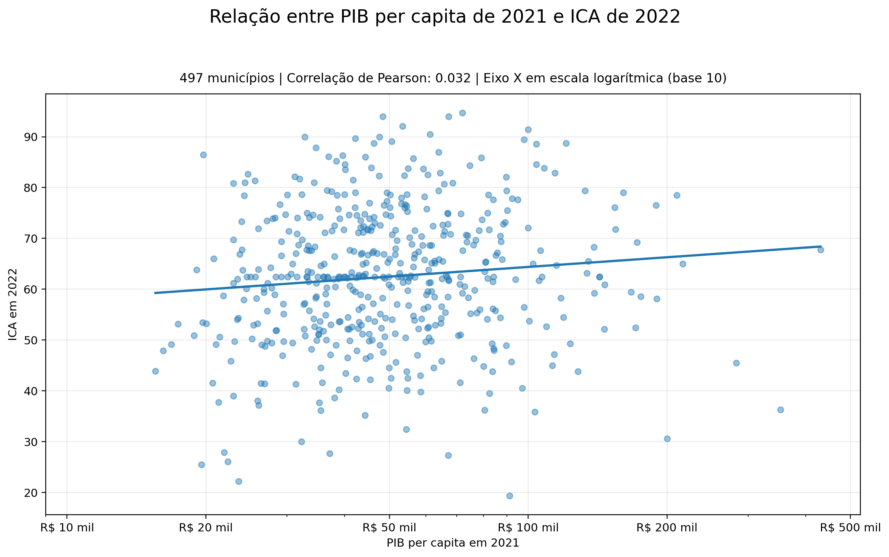

# Relatório

> [!CAUTION]
>
> - Você <ins>**não pode utilizar ferramentas de IA para escrever este relatório**</ins>.

## Identificação

- **Nome**: <mark>Caetano Szablewiski Sabadini</mark>
- **Cartão UFRGS:** <mark>00580199</mark>

## Dados utilizados

> [!IMPORTANT]
>
> - Os dados utilizados devem ser informados como **links** para as fontes originais.
> - Se houver mais de um conjunto de dados, liste todos separadamente.
> - Para cada conjunto de dados, inclua também uma **descrição curta** explicando os dados.

1. **Dataset 1**: <mark>[`<link>`](https://dados.rs.gov.br/dataset/dee-4571)</mark>
   - **Descrição curta**: <mark>PIB Per Capta dos municípios do Rio Grande do Sul a partir do ano de 2002</mark>
2. **Dataset 2**: <mark>[`<link>`](https://dados.rs.gov.br/dataset/dee-5271/resource/0b5e345b-5738-448c-a549-c5327b8da769)</mark>
   - **Descrição curta**: <mark>ICA (Indicador Criança Alfabetizada), percentual de crianças do segundo ano que conseguem ler e escrever, dos municípios do Rio Grande do Sul dos anos 2022 e 2023</mark>
3. ...

## Código-fonte da visualização

> [!IMPORTANT]
>
> - Indique abaixo onde está, dentro deste repositório, o código-fonte usado para gerar a visualização.

- **Arquivo principal**: <mark>main.py</mark>
- **Arquivos complementares (se houver)**:
  <mark>relation/boxplot_pib_ica.py</mark>
  <mark>relation/scatterplot_pib_ica.py</mark>

## Imagem da visualização gerada

> [!IMPORTANT]
>
> - Insira aqui uma imagem da visualização criada por você. Troque `imagem-da-visualizacao.png` pelo caminho correto do arquivo no repositório.
> - Se você criou alguma visualização interativa, então descreva aqui como acessá-la. Por exemplo, se for uma página HTML, coloque o link, ou se for uma visualização 3D, descreva como compilar e executar o código.

<mark>`<preencher abaixo>`</mark>

## Descrição da visualização

### Legenda (_caption_)

> [!IMPORTANT]
>
> - Escreva um texto curto explicando como interpretar a visualização. Descreva os elementos visuais, eixos, cores, símbolos ou interações relevantes.
> - Este texto seria a legenda (_caption_) que acompanharia a figura em uma publicação, por exemplo.

<mark>
scatterplot: para cada município do Rio Grande do Sul, o eixo x representa o pib per capta do municipio e o eixo y o índice de criança alfabetizada do município e a linha central é a relação geral entre os dois valores
boxplot: horizontalmente, os municípios estão agrupados de acordo com intervalos de pib per capta e, verticalmente, demarcados por uma haste vertical que varre o índice de qualidade de alfabetização com 5 linhas horizontais, onde cada região delimitada por 2 linhas (valores mínimo e máximo do intervalo) contém 25% dos valores totais do grupo. Cada grupo de municípios tem o número de integrantes e o intervalo que enquadra os elementos, além disso, o retângulo azul mostra o intervalo entre os 25 e 75% maiores valores;
</mark>

### Conclusão demonstrada pela visualização

> [!IMPORTANT]
>
> - Escreva uma conclusão curta sobre os dados com base na visualização.
> - Explique qual insight, padrão ou tendência pode ser observado.

<mark>podemos perceber que não há forte relação entre o pib per capta e o índce de crianças alfabetizadas no Rio Grande do Sul, visto a vasta distribuição de valores mostrada nos gráficos</mark>
